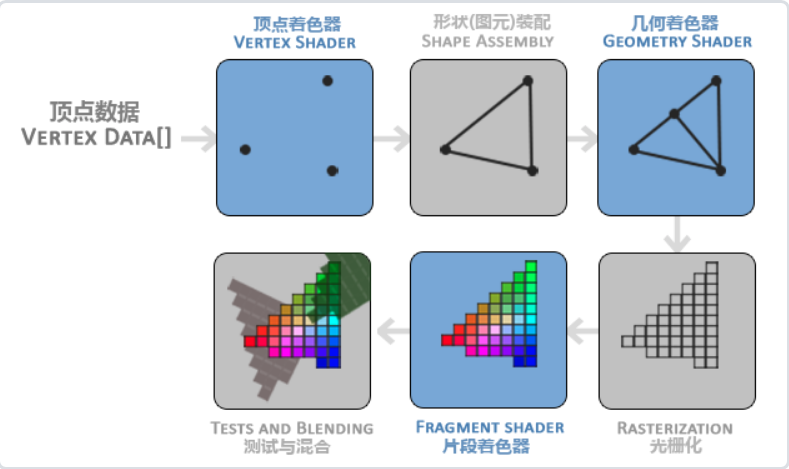
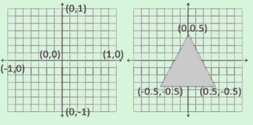
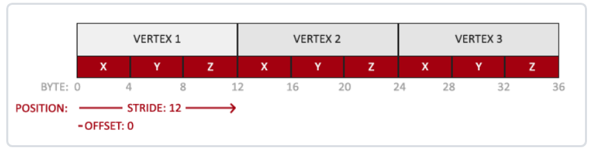

整个流程中涉及到了两个阶段的数据传输
1. CPU传输到GPU的内存
2. 将GPU内存中的数据传输给显卡

而VBO就是在

- 顶点数组对象：Vertex Array Object，VAO

- 顶点缓冲对象：Vertex Buffer Object，VBO

- 索引缓冲对象：Element Buffer Object，EBO或Inde

## 渲染管线
openGL的渲染管线主要做的事情就是处理3D坐标将其转换为2D坐标在窗口上显示，具体分成两个部分
1. 将3D坐标转换成2D坐标
2. 将2D坐标转变为实际有颜色的像素

上述的整个流程可以分成若干个小程序来进行，每个小程序被称之为着色器(shader)，其中有些着色器可以由开发者来自己配置，下图就展示了整个渲染管线中每一步分做的具体的动作:

1. vertex shader(顶点着色器):
2. shape assembly(形状装配):
3. geometry shader(几何着色器):
4. rasterization(光栅化):
5. fragment shader(片段着色器):
6. tests and blending(测试与混合):

## 顶点坐标
需要输入的点的坐标是三维坐标(x,y,z),其中z表示深度，具体如下图所示：

## 顶点着色器
    
    #version 330 core
    /*
     * layout设定了输入变量的位置值
     * in vec3 aPos表明 有一个类型为vec3的输入aPos
    */
    layout (location = 0) in vec3 aPos;

    void main(){
        /*将输入aPos转换成vec4类型的输出gl_Position*/
        gl_Position = vec4(aPos.x, aPos.y, aPos.z, 1.0);
    }
    

## 片段着色器
片段着色器要做的事情是计算像素最后的颜色输出，在计算机图形中颜色被表示为有4个元素的数组：红色、绿色、蓝色和alpha(透明度)分量，通常缩写为RGBA。当在OpenGL或GLSL中定义一个颜色的时候，我们把颜色每个分量的强度设置在0.0到1.0之间。比如说我们设置红为1.0f，绿为1.0f，我们会得到两个颜色的混合色，即黄色。这三种颜色分量的不同调配可以生成超过1600万种不同的颜色

## 着色器程序
着色器程序对象(Shader Program Object)是多个着色器合并之后并最终链接完成的版本，需要将编译的着色器链接为一个着色器程序对象，然后将该程序激活，激活之后会在发送渲染调用的时候被使用。

## 链接顶点属性
顶点缓冲数据会被解析为如下的格式

